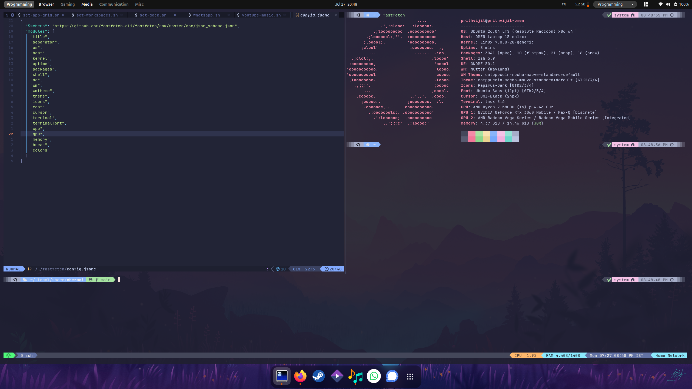

# dotfiles

Dotfiles for Ubuntu setup



## Instructions to run


[](https://youtu.be/3s-N7nsfI2Q) 

```shell
chmod +x setup/* 
```

```shell
bash setup/bootstrap.sh 
bash setup/install-apt-packages.sh 
bash setup/configure-env.sh 
bash setup/gnome-extensions.sh
bash setup/gnome-settings.sh
bash setup/whatsapp.sh
bash setup/youtube-music.sh
bash setup/set-app-grid.sh
bash setup/gnome-hotkeys.sh
bash setup/set-dock.sh
bash setup/set-workspaces.sh
```

```shell

chezmoi apply -v 

```
