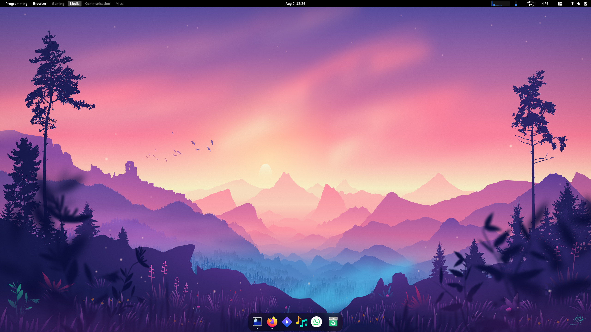
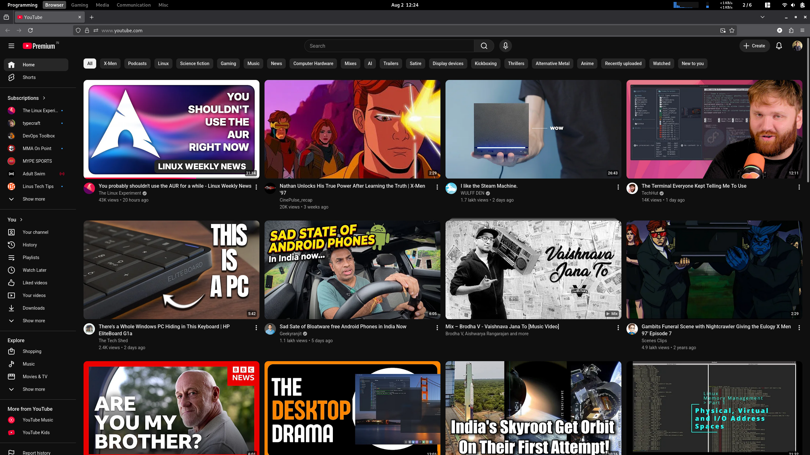
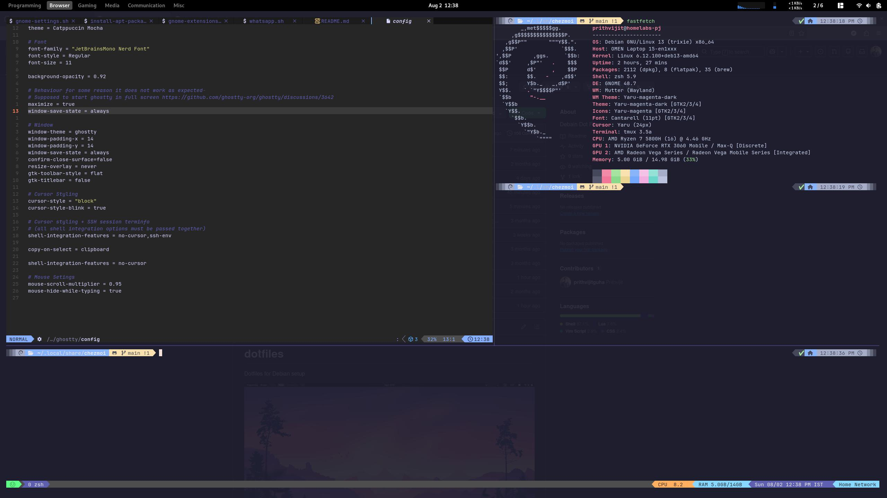

# dotfiles

Dotfiles for Debian setup








[Demo Video](https://github.com/user-attachments/assets/124bf891-5494-4051-8f73-2fc06a0b6812
)

## Instructions to run

```shell
chmod +x setup/* 
```

```shell
./setup/bootstrap.sh         
./setup/gnome-hotkeys.sh    
./setup/install-additional-applications.sh  
./setup/set-app-grid.sh  
./setup/set-workspaces.sh  
./setup/youtube-music.sh
./setup/gnome-extensions.sh  
./setup/gnome-settings.sh  
./setup/install-apt-packages.sh             
./setup/set-dock.sh      
./setup/whatsapp.sh
```

```shell

chezmoi apply -v 

```

References: Lot of inspiration taken from the amazing Omakub Repo: [https://github.com/basecamp/omakub](https://github.com/basecamp/omakub)
